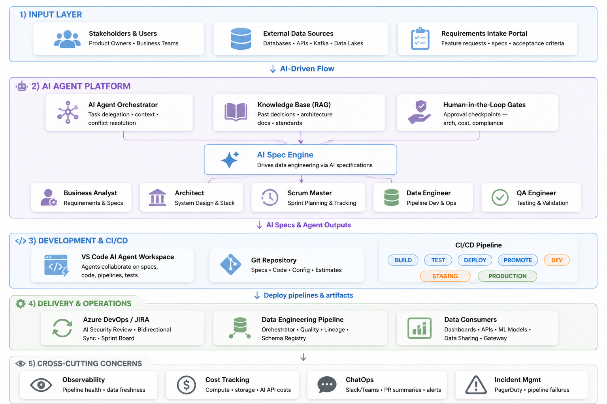

# Business Architecture: AI-Driven Data Engineering

**Status:** `Draft` | **Version:** `1.0.0` | **Domain:** `Business Strategy`

## 1. Strategic Vision
The objective of this platform is to transition the organization from a traditional **Ticket-Based Data Request** model to an **Autonomous Engineering Loop**. 

In the legacy model, business requirements are lost in translation as they move from Product Owners $\rightarrow$ BAs $\rightarrow$ Engineers. In this AI-Driven architecture, the "Translation Gap" is closed by embedding a multi-agent swarm directly into the technical workspace, allowing requirements to be converted into executable specifications and verified code in near real-time.

---

## 2. Business Capability Map

The platform implements four primary business capabilities that redefine the data engineering lifecycle:

### 2.1 Agile Intent Capture
Moving away from static PRDs (Product Requirement Documents) to a dynamic, agent-assisted intake process.
* **The Capability:** Converting high-level business "intents" into BDD (Behavior-Driven Development) Gherkin specs.
* **Business Value:** Eliminate ambiguity early in the sprint, reducing rework by ensuring developers build exactly what the business expects.

### 2.2 Accelerated Technical Discovery
Reducing the "Investigation Phase" of engineering by leveraging AI to map the enterprise landscape.
* **The Capability:** Using the MCP Gateway to atomically discover schemas, lineage, and historical decisions across SAP, Salesforce, and legacy SQL stores.
* **Business Value:** drastic reduction in "Discovery Time" from days of manual documentation hunting to seconds of agent-led exploration.

### 2.3 Autonomous Engineering Swarm
Shifting the engineer's role from "Manual Coder" to "Swarm Manager."
* **The Capability:** Orchestrating specialized agents (BA, Architect, DE, QA) to handle the mundane aspects of the SDLC (boilerplate code, unit tests, documentation).
* **Business Value:** Increases engineering velocity by $3\times$-$5\times$ by automating the "toil" and focusing human expertise on high-value architectural decisions.

### 2.4 Governed AI Promotion
Ensuring that "AI-generated" does not mean "untrusted."
* **The Capability:** A security-first CI/CD pipeline that treats AI code as untrusted until it passes six distinct security and compliance audit vectors.
* **Business Value:** Maintains enterprise security posture while embracing the speed of GenAI.

---

## 3. Value Stream Mapping

| Legacy Step | AI-Driven Evolution | Value Realization $\Delta$ |
| :--- | :--- | :--- |
| Manual Req. Gathering | **Agentic BDD Synthesis** | $\downarrow$ Ambiguity / $\uparrow$ Precision |
| Manual Schema Mapping | **MCP-Driven Discovery** | $\downarrow$ Lead Time to Design |
| Hand-coding Pipelines | **Swar-driven Implementation** | $\downarrow$ Dev Cycle Time |
| Manual QA Testing | **Automated Assertion Gates** | $\downarrow$ Production Defect Rate |
| Manual Deployment | **Sec-Agent Validated CI/CD** | $\uparrow$ Deployment Confidence |

---
**Navigation:**
- 🏛️ **Technical Blueprint:** [Solution Design](./01-solution-design.md)
- 🤖 **Intelligence Layer:** [Agent Orchestration](./agent-orchestration.md)
- ⚙️ **Delivery Pipeline:** [Engineering Operations](./engineering-operations một-operations.md)
