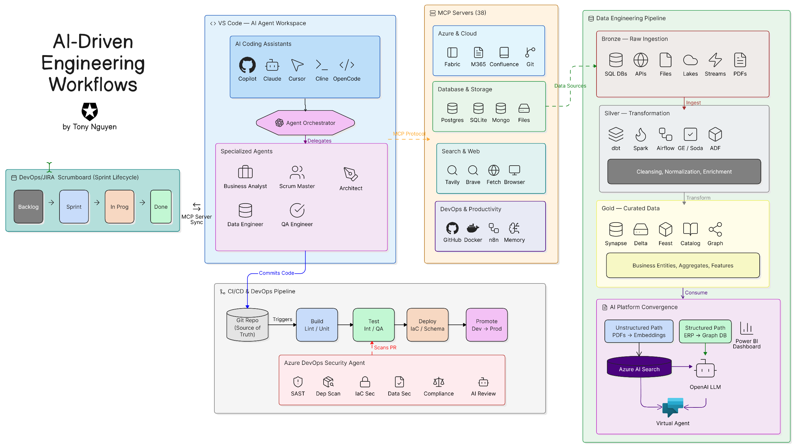

# Solution Design: AI-Driven Data Engineering Platform

**Status:** `Draft` | **Version:** `1.0.0` | **Architect:** `AI-Specialist Architect`

## 1. Executive Summary
The AI-Driven Data Engineering Platform is a paradigm shift from traditional ETL/ELT workflows to an **Agentic Engineering Loop**. By integrating a multi-agent AI swarm directly into the development environment (IDE) via the Model Context Protocol (MCP), the platform reduces the gap between business requirement and production deployment from weeks to hours.

### Core Objectives
* **Zero-Trust Discovery:** Use MCP to explore enterprise metadata without risking production stability.
* **Agentic Orchestration:** Deploy specialized AI roles (BA, Architect, DE, QA) to handle end-to-end lifecycle management.
* **Automated Governance:** Shift-left security and quality gating via an AI-driven CI/CD pipeline.

---

## 2. Conceptual Architecture: The 5-Layer Stack

### 2.1 Logical Flow & Responsibilities

| Layer | Designation | Primary Function | Key Technical Driver |
| :--- | :--- | :--- | :--- |
| **L1** | **Enterprise Sources** | Data Origin & Acquisition | Sling CLI, ADF, Kafka |
| **L2** | **MCP Gateway** | Semantic Context Bridge | Model Context Protocol (MCP) |
| **L3** | **Agent Workspace** | Collaborative Intelligence | VS Code $\rightarrow$ Agent Swarm |
| **L4** | **Validation Gate** | Quality & Compliance Vetting | Azure DevOps Sec Agent |
| **L5** | **Target Platforms** | Governed Data Consumption | Ms Fabric, Databricks, Purview |

### 2.2 Layer Deep-Dive

#### 🔹 Layer 1: Ingestion Strategy
The platform treats all sources as **Context Providers**. 
* **Batch Path:** High-throughput extraction using Sling for legacy SQL servers and ADF for enterprise ERPs.
* **Streaming Path:** Low-latency event ingestion via Azure Event Hubs $\rightarrow$ Fabric Real-Time Intelligence.

#### 🔹 Layer 2: The MCP Semantic Bridge
The MCP Gateway is the "nervous system." It prevents the LLM from "hallucinating" schemas by forcing it to query live, validated metadata servers:
* **Schema Discovery:** Dynamic DDL extraction for SQL/SAP.
* **Knowledge Graph:** Bi-directional sync between agent memory and Confluence/JIRA.

#### 🔹 Layer 3: Intelligence Cockpit
Engineers act as **Orchestrators**, not just coders.
* **The Loop:** `Human Intent` $\rightarrow$ `Agent Orchestrator` $\rightarrow$ `Specialized Agent Task` $\rightarrow$ `MCP Action` $\rightarrow$ `Code Output`.
* **Consistency:** State is preserved across the swarm to ensure a BA's requirement matches the QA's test case.

#### 🔹 Layer 4: The Quality Firewall
Code is never promoted without passing the **Security Agent Audit**.
* **Vectors:** SAST, Dependency scans, and AI-specific code review.
* **Gate:** PRs are automatically blocked if AI-generated code violates enterprise security patterns.

#### 🔹 Layer 5: Unified Consumption
Converging on Open Formats (Delta Lake) to avoid vendor lock-in.
* **Fabric Ecosystem:** Leveraging OneLake for a "single source of truth."
* **Databricks Ecosystem:** Unity Catalog for fine-grained cross-cloud governance.

---

## 3. Architecture Decision Log (ADL)

| Decision ID | Decision | Rationale | Alternative Considered |
| :--- | :--- | :--- | :--- |
| **AD-01** | Use MCP instead of custom APIs | Standardizes tool-use for any LLM; reduces custom glue code. | Custom REST wrappers |
| **AD-02** | Multi-Agent Swarm vs. Single LLM | Separation of concerns prevents "context drift" and improves QA accuracy. | Large-window Single LLM |
| **AD-03** | Delta Lake as Primary Format | Ensures interoperability between Fabric and Databricks. | Proprietary Parquet |
| **AD-04** | IDE-Centric Execution | Minimizes context switching for engineers; keeps agents "close to the code." | External Agent Portal |

---

## 4. Success Metrics (KPIs)
* **Lead Time to Production:** Reduce a standard pipeline build from 14 days $\rightarrow$ 2 days.
* **Defect Leakage:** Reduce production data bugs by 40% through AI-driven QA assertions.
* **Onboarding Speed:** New engineers should reach productivity in < 24 hours using MCP-driven knowledge bases.

---
**Navigation:**
- ⏭️ **How it's orchestrated:** [Agent Orchestration](./agent-orchestration.md)
- 🔌 **The connection map:** [MCP Catalog](./mcp-catalog.md)
- ⚙️ **The delivery pipeline:** [Engineering Operations](./engineering-operations.md)
